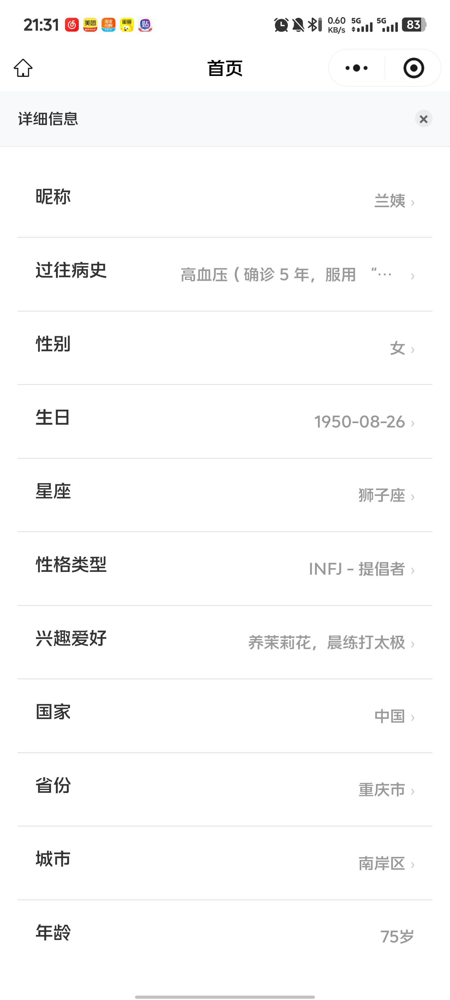
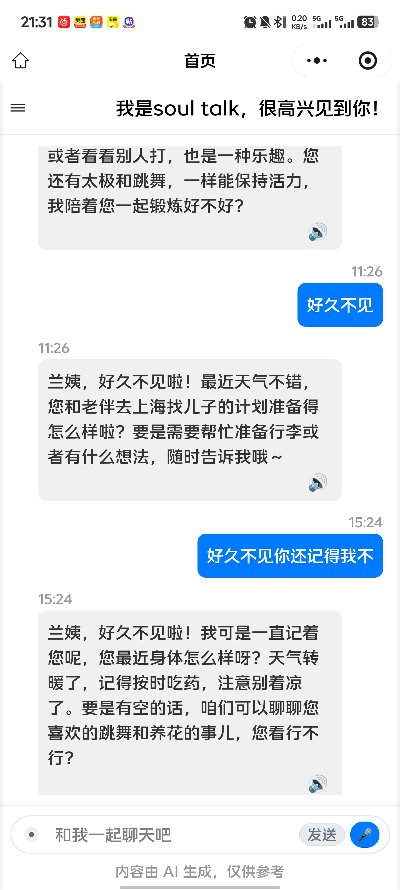
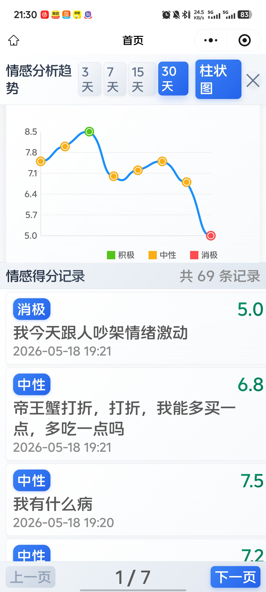

# SoulTalk

> 基于 Spring Boot 3 + 大模型能力的情绪陪伴与智能对话系统后端，支持用户登录注册、智能体创建、多轮对话、流式输出、长期记忆、语音识别、语音合成、情绪得分记录与后台管理。

`SoulTalk` 是一个面向情绪陪伴、智能聊天和个性化 AI 角色交互场景的后端项目。系统围绕“用户—智能体—对话—记忆—情绪分析”展开，接入阿里云 DashScope / 百炼大模型能力，支持普通对话、流式问答、长期记忆管理、智能体配置、语音转文本、文本转语音和用户情绪趋势分析。

---

## 目录

* [项目简介](#项目简介)
* [系统展示](#系统展示)
* [功能特性](#功能特性)
* [技术栈](#技术栈)
* [系统架构](#系统架构)
* [项目结构](#项目结构)
* [环境要求](#环境要求)
* [快速开始](#快速开始)
* [配置说明](#配置说明)
* [接口说明](#接口说明)
* [核心业务流程](#核心业务流程)
* [安全建议](#安全建议)
* [后续优化方向](#后续优化方向)
* [许可证](#许可证)

---

## 项目简介

`SoulTalk` 是一个智能陪伴类 AI 对话系统后端项目，主要提供以下能力：

* 用户账号注册、登录、微信登录和 JWT 鉴权；
* 用户资料、头像、详细信息和密码管理；
* 自定义智能体创建、查询、搜索和更新；
* 与主模型或指定智能体进行多轮对话；
* 支持 SSE 流式输出，实现类似 ChatGPT 的实时回复体验；
* 支持长期记忆创建、清空、同步和查询；
* 支持语音识别 STT 和语音合成 TTS；
* 支持情绪得分记录、分页查询、删除和图表展示；
* 支持后台管理员登录、注册、用户状态管理和 Word 文件管理。


---


## 系统展示

<p align="center">
  
</p>

<p align="center">
  
</p>

<p align="center">
  
</p>

---

## 功能特性

### 1. 用户认证与权限控制

* 用户注册；
* 用户登录；
* 微信登录；
* 密码重置；
* JWT Token 鉴权；
* Spring Security 无状态认证；
* CORS 跨域配置。

### 2. 用户信息管理

* 获取用户基础信息；
* 修改用户头像；
* 修改用户简介；
* 修改用户密码；
* 注销账号；
* 获取和修改用户详细资料；
* 用户情绪记录分页查询；
* 情绪趋势图数据查询；
* 批量删除情绪记录。

### 3. 智能体管理

* 创建自定义智能体；
* 上传智能体头像；
* 查询用户可见的智能体；
* 查询指定智能体详情；
* 模糊搜索智能体；
* 更新智能体；
* 查询个人创建的智能体。

### 4. 多轮对话

* 创建对话；
* 查询指定对话；
* 分页查询对话历史；
* 查询用户对话数量；
* 非流式问答；
* 流式问答；
* 清除上下文；
* 删除对话；
* 对话置顶 / 取消置顶。

### 5. 主模型对话与长期记忆

* 创建主模型对话；
* 获取主模型对话记录；
* 获取指定范围的对话历史；
* 主模型问答；
* SSE 流式输出；
* 清除上下文；
* 重置长期记忆；
* 同步用户信息到长期记忆；
* 获取长期记忆片段。

### 6. 语音交互

* WebSocket 语音转文本；
* WebSocket 文本转语音；
* 支持实时语音交互能力扩展。

### 7. 后台管理

* 管理员登录；
* 管理员注册；
* 管理员密码重置；
* 管理员信息查询；
* 管理员信息修改；
* 管理员删除；
* 查询所有用户账户状态；
* Word 文件上传、读取、删除和列表查询。

---

## 技术栈

| 分类          | 技术                          |
| ----------- | --------------------------- |
| 开发语言        | Java 17                     |
| 后端框架        | Spring Boot 3.5.3           |
| Web 框架      | Spring MVC                  |
| 安全认证        | Spring Security、JWT、BCrypt  |
| 数据库         | MySQL                       |
| ORM / 持久层   | MyBatis                     |
| 分页          | PageHelper                  |
| 大模型能力       | 阿里云 DashScope、阿里云百炼 Bailian |
| 语音能力        | DashScope NLS TTS / ASR     |
| 文件存储        | 阿里云 OSS、本地 Word 文件管理        |
| 实时通信        | SSE、WebSocket               |
| JSON 处理     | Fastjson                    |
| 接口文档        | Knife4j OpenAPI3            |
| AOP         | Spring AOP                  |
| Office 文档处理 | Apache POI                  |
| 构建工具        | Maven                       |

---

## 系统架构

```text
前端 / 小程序 / 管理端
        |
        | HTTP / SSE / WebSocket
        v
Spring Boot Controller
        |
        |-- AuthController：登录注册、微信登录
        |-- UserController：用户资料、情绪记录
        |-- AgentController：智能体管理
        |-- DialogueController：智能体对话
        |-- MainAgentController：主模型对话与长期记忆
        |-- AdminController：后台管理与文件管理
        |
        v
Service 业务层
        |
        |-- 用户业务
        |-- 智能体业务
        |-- 对话业务
        |-- 主模型业务
        |-- 语音业务
        |-- 文件业务
        |
        v
Mapper 持久层
        |
        v
MySQL 数据库

同时：

Service / AIGC 模块
        |
        |-- DashScope / 百炼：大模型问答、长期记忆
        |-- NLS：语音识别、语音合成
        |-- OSS：图片或文件上传
        |-- SSE：流式文本输出
        |-- WebSocket：实时语音交互
```

---

## 项目结构

```text
soul-talk/
├── .mvn/                         # Maven Wrapper 配置
├── src/
│   ├── main/
│   │   ├── java/com/soultalk/
│   │   │   ├── aigc/              # 大模型、主模型、语音能力接口与实现
│   │   │   ├── aop/               # AOP 切面
│   │   │   ├── config/            # Spring Security、WebSocket、静态资源等配置
│   │   │   ├── context/           # 当前用户上下文
│   │   │   ├── controller/        # 接口控制器
│   │   │   │   ├── request/       # 请求 / 返回对象
│   │   │   │   └── websocket/     # STT / TTS WebSocket 处理器
│   │   │   ├── filter/            # JWT 认证过滤器
│   │   │   ├── handle/            # 异常或统一处理模块
│   │   │   ├── mapper/            # MyBatis Mapper 接口
│   │   │   ├── po/                # 持久化对象 / 数据对象
│   │   │   ├── properties/        # 配置属性类
│   │   │   ├── service/           # 业务接口
│   │   │   │   └── impl/          # 业务实现类
│   │   │   ├── utils/             # 工具类
│   │   │   └── SoulTalkApplication.java
│   │   └── resources/
│   │       ├── com/soultalk/mapper/   # MyBatis XML 文件
│   │       ├── demo/                  # 示例资源
│   │       ├── application.yml
│   │       └── application.properties
│   └── test/
├── pom.xml
├── mvnw
├── mvnw.cmd
├── LICENSE
└── README.md
```

---

## 环境要求

请先准备以下环境：

* JDK 17+
* Maven 3.8+
* MySQL 8.x 或兼容版本
* 阿里云 DashScope / 百炼相关 API Key
* 阿里云 OSS 配置，可选
* Apifox / Postman，可选
* 支持 WebSocket 的前端或调试工具，可选

---

## 快速开始

### 1. 克隆项目

```bash
git clone https://github.com/JasperChenJH/soul-talk.git
cd soul-talk
```

### 2. 创建数据库

```sql
CREATE DATABASE soultalk DEFAULT CHARACTER SET utf8mb4 COLLATE utf8mb4_unicode_ci;
```

如果项目提供 SQL 初始化脚本，请导入对应脚本：

```bash
mysql -u root -p soultalk < soultalk.sql
```

如果没有 SQL 文件，可以根据 `po`、`mapper` 和业务接口补充表结构。

### 3. 修改配置文件

建议将数据库、OSS、大模型 API Key 等敏感信息改为环境变量读取。

`application.yml` 示例：

```yaml
spring:
  application:
    name: soultalk
  datasource:
    url: jdbc:mysql://${MYSQL_HOST:localhost}:${MYSQL_PORT:3306}/${MYSQL_DATABASE:soultalk}?useSSL=false&serverTimezone=Asia/Shanghai&characterEncoding=utf8mb4
    username: ${MYSQL_USERNAME:root}
    password: ${MYSQL_PASSWORD:root}
    driver-class-name: com.mysql.cj.jdbc.Driver
    hikari:
      maximum-pool-size: 10

mybatis:
  configuration:
    log-impl: org.apache.ibatis.logging.stdout.StdOutImpl
    map-underscore-to-camel-case: true

logging:
  level:
    root: info

soultalk:
  dashscope:
    api-key: ${DASHSCOPE_API_KEY:}
    workspace-id: ${DASHSCOPE_WORKSPACE_ID:}
  oss:
    endpoint: ${ALIYUN_OSS_ENDPOINT:}
    access-key-id: ${ALIYUN_OSS_ACCESS_KEY_ID:}
    access-key-secret: ${ALIYUN_OSS_ACCESS_KEY_SECRET:}
    bucket-name: ${ALIYUN_OSS_BUCKET_NAME:}
  wechat:
    appid: ${WECHAT_APPID:}
    secret: ${WECHAT_SECRET:}
```

`application.properties` 示例：

```properties
server.port=8080
server.shutdown=graceful
spring.lifecycle.timeout-per-shutdown-phase=5s
```

### 4. 配置环境变量

Linux / macOS：

```bash
export MYSQL_HOST=localhost
export MYSQL_PORT=3306
export MYSQL_DATABASE=soultalk
export MYSQL_USERNAME=root
export MYSQL_PASSWORD=你的数据库密码

export DASHSCOPE_API_KEY=你的DashScopeApiKey
export DASHSCOPE_WORKSPACE_ID=你的WorkspaceId

export ALIYUN_OSS_ENDPOINT=你的OSS地域节点
export ALIYUN_OSS_ACCESS_KEY_ID=你的AccessKeyId
export ALIYUN_OSS_ACCESS_KEY_SECRET=你的AccessKeySecret
export ALIYUN_OSS_BUCKET_NAME=你的Bucket名称

export WECHAT_APPID=你的微信AppId
export WECHAT_SECRET=你的微信Secret
```

Windows PowerShell：

```powershell
$env:MYSQL_HOST="localhost"
$env:MYSQL_PORT="3306"
$env:MYSQL_DATABASE="soultalk"
$env:MYSQL_USERNAME="root"
$env:MYSQL_PASSWORD="你的数据库密码"

$env:DASHSCOPE_API_KEY="你的DashScopeApiKey"
$env:DASHSCOPE_WORKSPACE_ID="你的WorkspaceId"

$env:ALIYUN_OSS_ENDPOINT="你的OSS地域节点"
$env:ALIYUN_OSS_ACCESS_KEY_ID="你的AccessKeyId"
$env:ALIYUN_OSS_ACCESS_KEY_SECRET="你的AccessKeySecret"
$env:ALIYUN_OSS_BUCKET_NAME="你的Bucket名称"

$env:WECHAT_APPID="你的微信AppId"
$env:WECHAT_SECRET="你的微信Secret"
```

### 5. 编译项目

使用 Maven：

```bash
mvn clean package
```

或者使用 Maven Wrapper：

```bash
./mvnw clean package
```

Windows：

```powershell
.\mvnw.cmd clean package
```

### 6. 启动项目

```bash
mvn spring-boot:run
```

或者：

```bash
java -jar target/SoulTalk-1.0.0.jar
```

项目默认端口：

```text
http://localhost:8080
```

接口文档地址可尝试访问：

```text
http://localhost:8080/doc.html
```

---

## 配置说明

### 数据库配置

项目使用 MySQL 作为主要业务数据库，用于存储用户、智能体、对话、情绪记录、管理员等数据。

### JWT 与权限配置

项目使用 Spring Security + JWT 实现认证。以下接口默认放行：

```text
/auth/login
/auth/register
/auth/resetPassword
/auth/wechat/login
/admin/login
/admin/register
/main/ask
/dia/streamQuestion
/ws/**
/resources/**
```

其他接口需要携带有效 Token 访问。

### 大模型配置

`aigc` 模块封装了主模型调用、流式调用、长期记忆管理和语音能力。主要能力包括：

* 普通问答；
* 流式问答；
* 创建长期记忆 ID；
* 创建记忆片段；
* 查询长期记忆；
* 清空 / 删除长期记忆；
* 删除记忆片段；
* 更新长期记忆描述。

### WebSocket 配置

项目注册了两个 WebSocket 路径：

```text
/ws/stt   # Speech To Text，语音转文本
/ws/tts   # Text To Speech，文本转语音
```

---

## 接口说明

### 1. 用户认证接口

| 请求方式 | 路径                    | 说明   |
| ---- | --------------------- | ---- |
| POST | `/auth/login`         | 用户登录 |
| POST | `/auth/register`      | 用户注册 |
| GET  | `/auth/wechat/login`  | 微信登录 |
| POST | `/auth/resetPassword` | 重置密码 |

### 2. 用户信息接口

| 请求方式   | 路径                       | 说明        |
| ------ | ------------------------ | --------- |
| GET    | `/user/info`             | 获取用户基础信息  |
| POST   | `/user/updatePhoto`      | 修改用户头像    |
| POST   | `/user/updateIntroduce`  | 修改用户简介    |
| POST   | `/user/updatePassword`   | 修改用户密码    |
| GET    | `/user/drop`             | 注销账号      |
| GET    | `/user/detail/info`      | 获取用户详细信息  |
| POST   | `/user/detail/update`    | 修改用户详细信息  |
| GET    | `/user/emotion/pagelist` | 分页查询情绪记录  |
| DELETE | `/user/emotion/delete`   | 删除情绪记录    |
| GET    | `/user/emotion/chart`    | 查询情绪趋势图数据 |

### 3. 智能体接口

| 请求方式 | 路径                     | 说明           |
| ---- | ---------------------- | ------------ |
| POST | `/agent/create`        | 创建智能体        |
| GET  | `/agent/select/all`    | 查询用户可见的所有智能体 |
| GET  | `/agent/select/info`   | 查询指定智能体详情    |
| GET  | `/agent/select/like`   | 按名称模糊搜索智能体   |
| POST | `/agent/update`        | 更新智能体        |
| GET  | `/agent/select/myself` | 查询个人创建的智能体   |

### 4. 智能体对话接口

| 请求方式 | 路径                    | 说明          |
| ---- | --------------------- | ----------- |
| POST | `/dia/create`         | 创建对话        |
| GET  | `/dia/getDia`         | 获取指定对话详情    |
| GET  | `/dia/getRangeDia`    | 查询一定范围内的对话  |
| GET  | `/dia/countDia`       | 查询对话数量      |
| POST | `/dia/question`       | 非流式提问       |
| POST | `/dia/streamQuestion` | 流式提问        |
| POST | `/dia/remove/content` | 清除上下文       |
| POST | `/dia/remove/all`     | 删除对话        |
| POST | `/dia/update/level`   | 对话置顶 / 取消置顶 |

### 5. 主模型接口

| 请求方式 | 路径                     | 说明                |
| ---- | ---------------------- | ----------------- |
| POST | `/main/create`         | 创建主模型对话           |
| GET  | `/main/get`            | 获取某个对话索引的详情       |
| GET  | `/main/getAll`         | 获取用户全部主模型对话       |
| GET  | `/main/getRange`       | 获取指定范围主模型对话       |
| POST | `/main/ask`            | 主模型问答，支持 SSE 流式输出 |
| GET  | `/main/clear`          | 清除上下文             |
| GET  | `/main/clearMemory`    | 重置长期记忆            |
| GET  | `/main/refreshInfo`    | 同步用户信息到长期记忆       |
| GET  | `/main/getMemoryNodes` | 获取长期记忆片段          |

### 6. WebSocket 语音接口

| 路径        | 说明    |
| --------- | ----- |
| `/ws/stt` | 语音转文本 |
| `/ws/tts` | 文本转语音 |

### 7. 管理端接口

| 请求方式   | 路径                     | 说明         |
| ------ | ---------------------- | ---------- |
| POST   | `/admin/login`         | 管理员登录      |
| POST   | `/admin/register`      | 管理员注册      |
| POST   | `/admin/resetPassword` | 重置管理员密码    |
| GET    | `/admin/info`          | 获取管理员信息    |
| POST   | `/admin/update`        | 修改管理员信息    |
| DELETE | `/admin/delete`        | 删除管理员      |
| GET    | `/admin/users/status`  | 获取所有用户账户状态 |
| POST   | `/admin/word/upload`   | 上传 Word 文件 |
| GET    | `/admin/word/read`     | 读取 Word 文件 |
| DELETE | `/admin/word/delete`   | 删除 Word 文件 |
| GET    | `/admin/word/list`     | 列出 Word 文件 |

---

## 核心业务流程

### 用户登录流程

```text
用户提交账号密码
        |
        v
/auth/login
        |
        v
AuthService 校验账号密码
        |
        v
生成 JWT Token
        |
        v
返回 Token 与用户信息
```

### 智能体对话流程

```text
用户选择或创建智能体
        |
        v
创建对话 /dia/create
        |
        v
提交问题 /dia/question 或 /dia/streamQuestion
        |
        v
DiaService 组织上下文与智能体设定
        |
        v
调用大模型接口
        |
        v
保存对话记录并返回回答
```

### 主模型长期记忆流程

```text
用户补充个人信息
        |
        v
/main/refreshInfo
        |
        v
同步用户信息到长期记忆
        |
        v
用户提问 /main/ask
        |
        v
模型结合上下文与长期记忆生成回答
```

### 语音交互流程

```text
前端建立 WebSocket 连接
        |
        |-- /ws/stt：上传音频流，返回识别文本
        |
        |-- /ws/tts：发送文本，返回语音数据
```

---

## 安全建议

当前项目涉及数据库连接、阿里云 API Key、OSS AccessKey、微信密钥等敏感配置。公开仓库或生产环境中建议：

1. 不要将真实数据库账号、密码、服务器 IP、AccessKey、Secret 提交到 GitHub；
2. 将敏感配置统一改为环境变量读取；
3. 将本地真实配置文件加入 `.gitignore`；
4. 提供 `application-example.yml` 作为配置模板；
5. 如果密钥已经提交到公开仓库，应立即到对应平台重置密钥；
6. 生产环境不要使用默认密码，例如 `a12345`；
7. 管理员重置密码逻辑建议改为随机强密码或邮件验证；
8. 文件上传接口应限制文件类型、文件大小和保存路径；
9. CORS 生产环境不建议使用 `*`，应改成具体前端域名；
10. JWT 密钥应使用复杂随机字符串，并定期轮换。

推荐 `.gitignore` 增加：

```gitignore
# local config
application-local.yml
application-dev.yml
application-secret.yml
.env
*.env

# build output
target/

# IDE
.idea/
.vscode/
*.iml

# logs
logs/
*.log

# uploaded files
upload/
uploads/
files/
```

---

## 后续优化方向

* [ ] 补充数据库初始化 SQL；
* [ ] 补充完整接口文档和请求示例；
* [ ] 增加统一异常处理说明；
* [ ] 优化权限模型，区分普通用户、管理员和超级管理员；
* [ ] 增加智能体 Prompt 模板管理；
* [ ] 增加长期记忆可视化管理页面；
* [ ] 增加 RAG 知识库接入能力；
* [ ] 增加语音通话式交互；
* [ ] 增加情绪分析模型或更细粒度情绪标签；
* [ ] 增加 Docker Compose，一键启动 MySQL 和后端服务；
* [ ] 增加单元测试和接口测试；
* [ ] 增加前端项目运行说明。

---


## 许可证

本项目基于 AGPL-3.0 License 开源，详情请查看 [LICENSE](./LICENSE)。

---

## 项目总结

`SoulTalk` 完成了一个大模型情绪陪伴系统后端的核心功能，覆盖用户体系、智能体管理、多轮对话、流式输出、长期记忆、语音交互、情绪记录和后台管理等模块。项目能够体现 Spring Boot 后端开发、大模型 API 接入、AI Agent 业务设计、WebSocket 实时通信和智能对话系统工程化落地能力。
